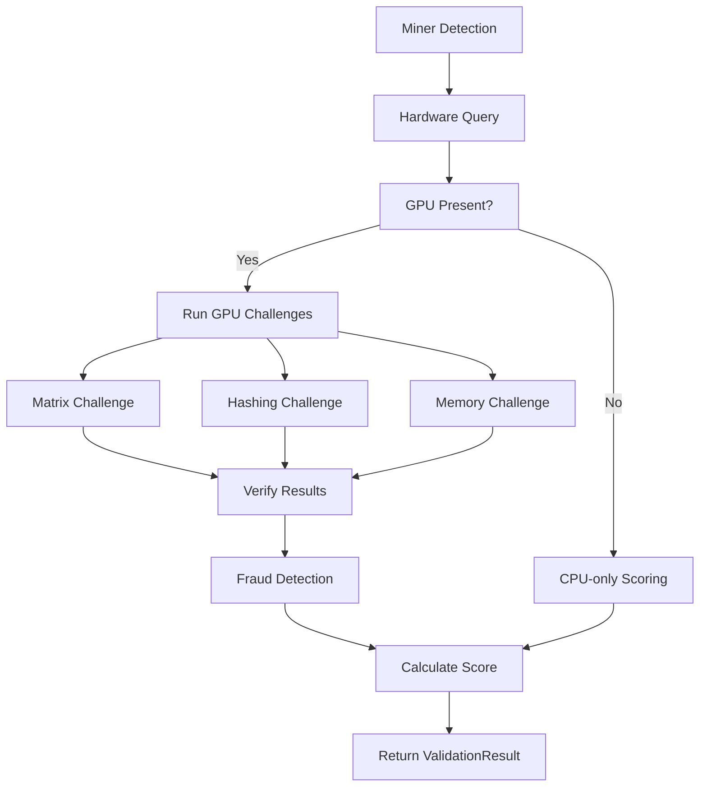

# 🚀 GPU Proof-of-Work Validation System

## Overview

The Polaris Validator now includes a comprehensive **GPU Proof-of-Work validation system** that prevents fraud in the compute rental marketplace through real hardware verification and computational challenges.

## ✨ Features

### 🔒 **Fraud Prevention**
- **Anti-Replay Protection**: Prevents reuse of challenge solutions
- **Performance Baseline Comparison**: Detects impossible performance claims
- **Hash Verification**: Cryptographically verifies computation results
- **Timing Analysis**: Detects suspiciously fast computation times
- **Hardware Consistency Checks**: Validates claimed vs actual hardware

### 🎯 **Multiple Challenge Types**
1. **Matrix Multiplication**: Tests GPU compute performance with actual math verification
2. **Hashing Challenges**: GPU-accelerated SHA-256 with difficulty targets
3. **Memory Bandwidth**: Tests GPU memory subsystem performance

### 🖥️ **Multi-Vendor GPU Support**
- **NVIDIA**: Full support via pynvml + CUDA
- **AMD**: Support via OpenCL 
- **Intel Arc**: Support via OpenCL
- **Apple Silicon**: Support via OpenCL
- **CPU-only**: Fallback scoring for systems without GPUs

### 📊 **Advanced Scoring**
- **Performance Percentiles**: Compare against known GPU baselines
- **Confidence Scoring**: 0-1 confidence in validation results
- **Fraud Indicators**: Specific fraud detection flags
- **Historical Reputation**: Track miner performance over time

## 🔧 Installation

### Option 1: Automatic Installation (Recommended)
```bash
# Run the automated installer
./install_gpu_support.sh
```

### Option 2: Manual Installation
```bash
# Install optional GPU libraries
pip install -r requirements-gpu.txt

# Or install individually:
pip install pynvml>=11.4.1          # NVIDIA monitoring
pip install pyopencl>=2023.1        # OpenCL support
pip install cupy-cuda12x>=12.0.0    # CUDA compute (CUDA 12.x)
# pip install cupy-cuda11x>=11.0.0  # CUDA compute (CUDA 11.x)
```

### System Requirements

**For NVIDIA GPUs:**
- NVIDIA drivers
- CUDA toolkit (optional, for compute challenges)

**For AMD/Intel GPUs:**
- OpenCL drivers
- GPU vendor drivers

**For macOS:**
- OpenCL is built-in

## 📋 Usage

The GPU validation runs automatically as part of the validator:

```python
# GPU validation is integrated into the main validator
from neurons.validator import PolarisNode

async with PolarisNode() as validator:
    # GPU validation runs automatically during miner processing
    pass
```

### Manual Testing
```python
from gpu_proof_of_work import GPUProofOfWork

# Initialize GPU validation system
gpu_pow = GPUProofOfWork()

# Check what's available
print(f"GPU validation enabled: {gpu_pow.enabled}")
print(f"NVIDIA available: {gpu_pow.nvidia_available}")
print(f"OpenCL available: {gpu_pow.opencl_available}")
```

## 🏗️ Architecture

### Core Components

1. **GPUProofOfWork**: Main validation system
2. **ValidationChallenge**: Base class for challenges
3. **MatrixMultiplicationChallenge**: Compute verification
4. **HashingChallenge**: Proof-of-work verification  
5. **MemoryBandwidthChallenge**: Memory subsystem testing
6. **ValidationResult**: Comprehensive result container

### Validation Flow



## 🛡️ Security Features

### Anti-Fraud Measures
- **Challenge Uniqueness**: Each challenge has unique parameters
- **Replay Protection**: Tracks used challenges per miner
- **Performance Bounds**: Validates against hardware capabilities
- **Hash Verification**: Cryptographic proof of computation
- **Timing Analysis**: Detects impossible computation speeds

### Fraud Detection Indicators
- `impossibly_fast_computation`: Computation time too fast for hardware
- `replay_attack_detected`: Reuse of previous challenge solution
- `hash_verification_failed`: Invalid computation proof
- `performance_inconsistent`: Performance doesn't match hardware
- `hardware_mismatch`: Claimed vs detected hardware mismatch

## 📊 Scoring Algorithm

### Base Score Calculation
```python
base_score = 1.0

# Apply fraud penalties
for fraud_indicator in fraud_indicators:
    if 'FRAUD' in fraud_indicator:
        base_score *= 0.1  # 90% penalty
    elif 'suspicious' in fraud_indicator:
        base_score *= 0.5  # 50% penalty
    else:
        base_score *= 0.8  # 20% penalty

# GPU systems: performance-based scoring
if has_gpu:
    gpu_score = avg_challenge_performance * baseline_multiplier * memory_bonus
    final_score = base_score * gpu_score

# CPU systems: thread-based scoring  
else:
    cpu_score = min(cores * threads / 32, 1.0)
    final_score = base_score * cpu_score

# Cap at 2.0 for high-end systems
final_score = min(final_score, 2.0)
```

### Performance Baselines
The system includes performance baselines for popular GPUs:

| GPU Model | Matrix Score | Hashing Score | Memory Score |
|-----------|-------------|---------------|--------------|
| RTX 4090 | 100.0 | 150.0 | 100.0 |
| RTX 4080 | 80.0 | 120.0 | 85.0 |
| RTX 3080 | 70.0 | 100.0 | 75.0 |
| RX 7900 XTX | 85.0 | 140.0 | 90.0 |
| Arc A770 | 35.0 | 40.0 | 40.0 |

## 🔧 Configuration

### Challenge Parameters
```python
# Matrix multiplication challenge
MatrixMultiplicationChallenge(size=1024)  # 1024x1024 matrices

# Hashing challenge  
HashingChallenge(target_difficulty=18)    # ~262k hashes average

# Memory bandwidth challenge
MemoryBandwidthChallenge(size_mb=512)     # 512MB memory test
```

### System Parameters
```python
validation_frequency = 100    # Validate every 100 blocks
cache_duration = 3600         # Cache results for 1 hour
challenge_history_limit = 1000 # Keep 1000 challenges per miner
target_challenge_time = 30.0   # Target 30 seconds per challenge
```

## 🐛 Troubleshooting

### Common Issues

**GPU libraries not found:**
```bash
# Run the installer
./install_gpu_support.sh

# Or check what's missing:
python3 -c "
try: import pynvml; print('✅ pynvml OK')
except ImportError: print('❌ pynvml missing')

try: import pyopencl; print('✅ pyopencl OK') 
except ImportError: print('❌ pyopencl missing')

try: import cupy; print('✅ cupy OK')
except ImportError: print('ℹ️ cupy not available')
"
```

**CUDA not found:**
```bash
# Check CUDA installation
nvcc --version

# Install CUDA toolkit:
# https://developer.nvidia.com/cuda-downloads
```

**OpenCL not found (Linux):**
```bash
# Install OpenCL drivers
sudo apt install nvidia-opencl-dev   # NVIDIA
sudo apt install amd-opencl-dev      # AMD
sudo apt install intel-opencl-icd    # Intel
```

### Debug Mode
```python
from gpu_proof_of_work import GPUProofOfWork
import logging

# Enable debug logging
logging.basicConfig(level=logging.DEBUG)

gpu_pow = GPUProofOfWork()
# Check detailed status...
```

## 🚀 Performance

### Benchmark Results
On a typical system with RTX 3080:
- **Matrix Challenge**: ~2.1 seconds for 2048x2048
- **Hash Challenge**: ~45 seconds for difficulty 20
- **Memory Challenge**: ~1.8 seconds for 1GB test
- **Total Validation**: ~50 seconds per miner

### Optimization Tips
1. **Adjust challenge sizes** based on your hardware
2. **Use caching** to reduce redundant validations  
3. **Tune validation frequency** for your subnet tempo
4. **Monitor memory usage** with large matrices

## 🔮 Future Enhancements

- [ ] **Real Protocol Integration**: Replace simulation with actual miner communication
- [ ] **Dynamic Difficulty Adjustment**: Adjust challenge difficulty based on performance
- [ ] **Reputation System**: Track long-term miner performance
- [ ] **Custom Challenge Types**: Plugin system for new validation methods
- [ ] **Distributed Validation**: Cross-validator challenge verification
- [ ] **ML Fraud Detection**: Advanced anomaly detection algorithms

## 📄 License

This GPU validation system is part of the Polaris Validator project.

---

**Need help?** Check the troubleshooting section or create an issue with your system specs and error logs. 